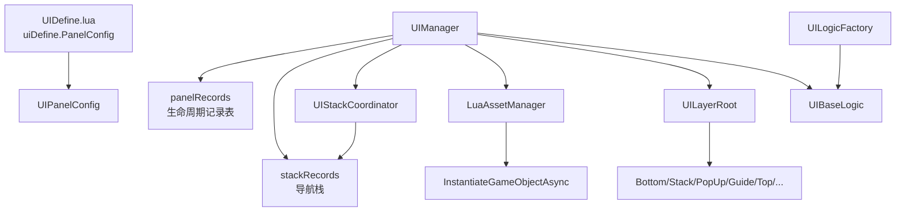
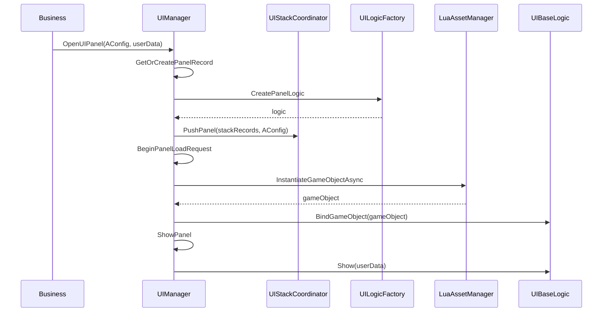
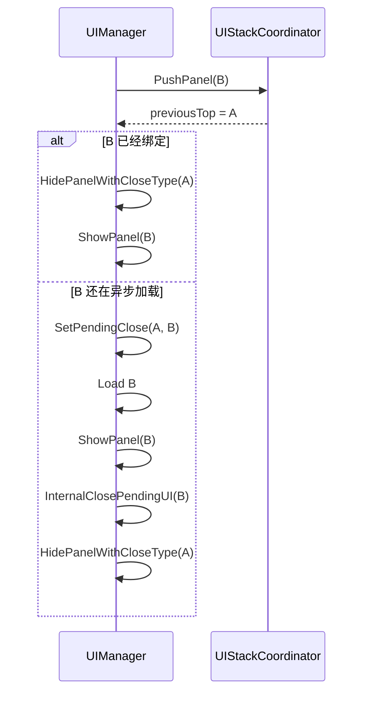
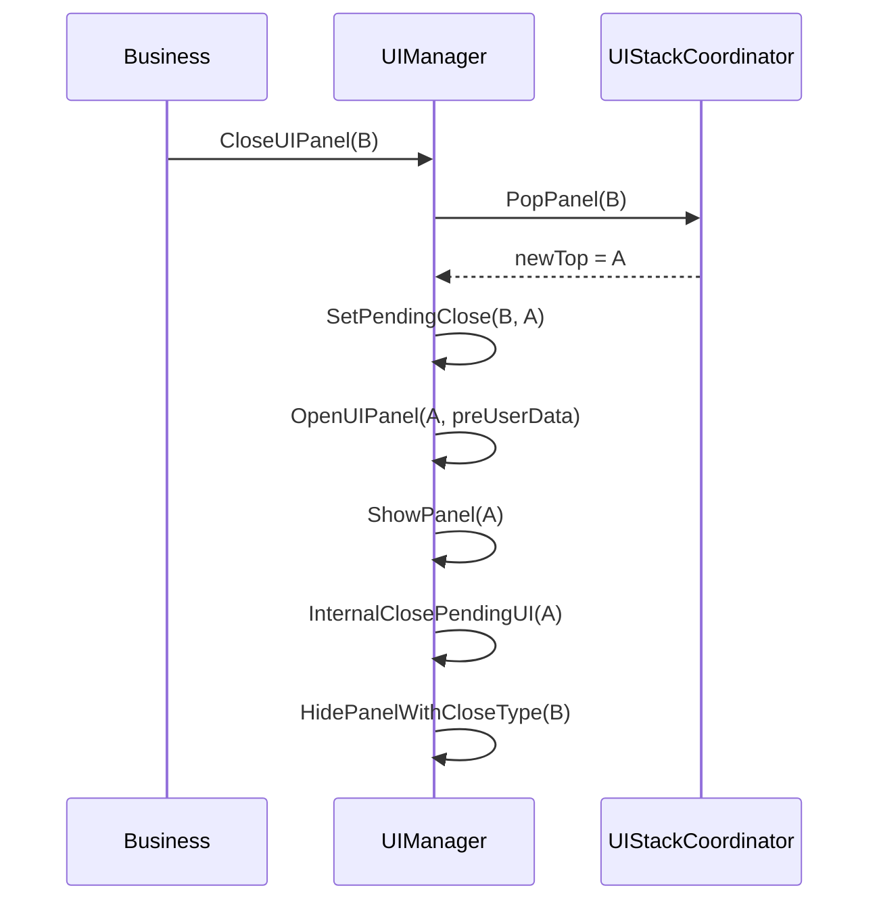

# UIManager UI 框架分析

本文档基于当前工程中的 UI 框架代码整理，重点解释 `UIManager` 如何管理界面打开、异步加载、进栈出栈、隐藏销毁、场景切换恢复，以及前面提问中涉及的 `PreloadPanels` 和 `Coroutine.YieldNull()`。

主要源码：

- `Framework/UI/UIManager.lua`
- `Framework/UI/UIStackCoordinator.lua`
- `Framework/UI/UIBaseLogic.lua`
- `Framework/UI/UIPanelConfig.lua`
- `Framework/UI/UIDefine.lua`
- `Framework/UI/UILogicFactory.lua`
- `Framework/UI/UILayerRoot.lua`

## 一句话总览

这个 UI 框架把“界面导航顺序”和“界面生命周期实例”分开管理：

- `stackRecords` 管导航栈：谁在栈顶、关闭后回到哪个界面。
- `panelRecords` 管生命周期：每个 `UIPanelConfig` 当前是否有 logic、是否加载中、是否可见、是否等待关闭。
- `UIStackCoordinator` 只负责进栈/出栈的数组规则。
- `UIManager` 负责状态机、异步加载、显示隐藏、销毁回收、pending close 竞态处理。

## 核心数据结构

### `UIPanelConfig`

定义位置：`Framework/UI/UIPanelConfig.lua`

每个主界面都有一个 `UIPanelConfig`，配置来自 `Framework/UI/UIDefine.lua` 的 `uiDefine.PanelConfig`。

关键字段：

| 字段 | 作用 |
| --- | --- |
| `ResPath` | prefab 资源路径 |
| `ClassName` | Lua logic require 路径 |
| `IgnoreStack` | 是否跳过导航栈；`false` 表示进入 `stackRecords` |
| `OrderLayer` | UI 挂载层级 |
| `CloseType` | 关闭时隐藏还是销毁 |
| `BlurMode` | 是否启用模糊背景 |
| `BlurCloseOnClick` | 点击模糊背景是否关闭 |
| `AutoDestroyWhenChangeScene` | 切场景时是否自动销毁 |
| `ForceXGamma` | 是否强制开启 XGamma |

默认规则：

- `IgnoreStack` 默认 `false`。
- `IgnoreStack == true` 时，默认挂到 `PopUpLayer`。
- `IgnoreStack == false` 时，默认挂到 `StackLayer`。
- `CloseType` 默认 `Destroy`。
- `AutoDestroyWhenChangeScene` 默认 `true`。

### `UIBaseLogic`

定义位置：`Framework/UI/UIBaseLogic.lua`

`UIBaseLogic` 是界面 Lua 逻辑基类，`UIManager` 管理的是 Panel 主容器类型的 `UIBaseLogic`。

关键字段：

| 字段 | 作用 |
| --- | --- |
| `PanelConfig` | 当前主面板对应的 `UIPanelConfig` |
| `uiGameObject` | 绑定的 Unity GameObject |
| `isLoaded` | 是否已绑定 GameObject |
| `isLogicVisible` | 逻辑层是否显示 |
| `logicUserData` | 打开界面时传入的数据 |
| `elementsLogic` | 子 Element 逻辑列表 |
| `Logic` | ObjectBinder 绑定出来的子逻辑 |
| `Widget` | ObjectBinder 绑定出来的 UI 控件 |
| `blurKey` | 模糊背景纹理 key |

`isLoaded` 的来源很重要：

```lua
function UIBaseLogic:BindGameObject(gameObject)
    self.uiGameObject = gameObject
    self.isLoaded = true
    ...
end
```

也就是说，`isLoaded == true` 表示 prefab 已经加载并且 GameObject 已经和 Lua logic 绑定。

`UnBindGameObject()` 会把 `isLoaded` 置回 `false`，通常发生在销毁逻辑时。

### `UIPanelRecord`

定义位置：`Framework/UI/UIManager.lua`

`panelRecords` 的 value 是 `UIPanelRecord`，它是 UIManager 的生命周期事实源。

```lua
self.panelRecords = {}
```

每个 record 大致包含：

| 字段 | 作用 |
| --- | --- |
| `logic` | 当前界面的 logic 实例 |
| `state` | 当前生命周期状态 |
| `requestId` | 当前异步加载请求 ID |
| `callbacks` | 加载完成后要回调的函数队列 |
| `userData` | 当前/最后一次打开传入的数据 |
| `pendingCloseTarget` | 等哪个界面显示后再关闭自己 |
| `closeForceDestroy` | pending close 时是否强制销毁 |
| `closeStopCloseAnim` | pending close 时是否停止关闭动画 |
| `staleDisposeLogics` | 过期异步请求回收用 |

`panelRecords` 的 key 是 `UIPanelConfig`。

注意：`panelRecords` 通常不会因为界面销毁而删 key。销毁时主要是 `record.logic = nil`，状态切到 `Destroyed`。下次打开同一个 `config` 时可以复用 record 并重新创建 logic。

### `stackRecords`

定义位置：`Framework/UI/UIManager.lua`

```lua
self.stackRecords = {}
```

每个元素是：

```lua
{
    LogicConfig = config,
    preUserData = userData,
}
```

它是数组，最后一个元素是栈顶：

```lua
stackRecords[#stackRecords]
```

`stackRecords` 只记录导航顺序，不等于“所有已加载界面列表”。一个界面可能在 `panelRecords` 中有 logic，但不在栈里；比如 `IgnoreStack == true` 的弹窗，或者已隐藏但保留的面板。

### `savedWorldPanelStack`

定义位置：`Framework/UI/UIManager.lua`

```lua
self.savedWorldPanelStack = {}
```

它按世界类型保存 UI 栈，用于从战斗等场景回来后恢复原先栈顶。

## 生命周期状态机

`UIManager` 用显式状态机管理面板生命周期。

状态定义：

| 状态 | 含义 |
| --- | --- |
| `None` | 初始态 |
| `Creating` | logic 已创建，还未进入资源加载 |
| `Loading` | 正在异步加载或等待绑定 GameObject |
| `Visible` | 已显示 |
| `Hidden` | 已隐藏，但 logic 仍保留 |
| `Closing` | 收到关闭意图，但异步流程未收尾 |
| `Destroyed` | 已彻底销毁 |
| `Failed` | 打开/加载失败 |

唯一合法状态切换入口：

```lua
UIManager:TransitionPanel(config, event)
```

它会检查 `UIAllowedTransitions`，非法迁移会打错误日志。这样做的目的，是让异步加载、重复打开、关闭中重开、失败回滚这些竞态路径可追踪。

常见状态路径：

```text
None -> Creating -> Loading -> Visible -> Hidden
None -> Creating -> Loading -> Visible -> Destroyed
Loading -> Closing -> Hidden/Destroyed
Loading -> Failed
Destroyed -> Creating
Failed -> Creating
```

## UI 框架整体关系



## 打开界面流程

入口：

```lua
Game.UIManager:OpenUIPanel(config, userData, callback)
```

核心函数：`UIManager:OpenUIPanel`

流程：

1. 检查 `config` 是否有效。
2. `GetOrCreatePanelRecord(config)` 获取或创建 record。
3. 触发 `GuideEvent.OnUIPanelWillShow`，用于引导系统提前感知打开请求。
4. 如果 record 里有已销毁或失败的旧 logic，清掉。
5. 如果当前界面有 pending close，清掉 pending close，表示“关闭中又重新打开”。
6. 如果界面正在 loading：
   - 追加 callback。
   - 更新栈。
   - 直接返回已有 loading logic。
7. 如果没有可用 logic：
   - 通过 `Game.UILogicFactory:CreatePanelLogic(config)` 创建 logic。
   - `logic:InitLogic(userData)`。
   - 写入 `panelRecords`。
   - 状态切到 `Creating`。
8. 调用 `HandlePanelPush(logic, userData)` 处理进栈。
9. 如果 logic 还没有绑定 GameObject：
   - `BeginPanelLoadRequest` 生成 `requestId`。
   - 状态切到 `Loading`。
10. 启动 logic 协程：
    - 如果需要 blur，先抓屏。
    - 如果已经绑定 GameObject，直接 `ShowPanel`。
    - 否则走 `LoadUIPanelCoroutine` 异步加载 prefab。

简化调用链：

```text
OpenUIPanel
  -> GetOrCreatePanelRecord
  -> CreatePanelLogic / reuse logic
  -> HandlePanelPush
     -> UIStackCoordinator:PushPanel
  -> BeginPanelLoadRequest
  -> logic:StartCoroutine
     -> LoadUIPanelCoroutine 或 ShowPanel
```

## UILogic 创建

创建逻辑对象由 `UILogicFactory` 完成：

```lua
local panelClass = require(config.ClassName)
local logic = panelClass.new(config)
logic:SetPanelConfig(config)
```

因此，每个 UI logic 类通常是 `UIBaseLogic` 的派生类，并通过 `PanelConfig` 连接到 UIManager 生命周期。

## 异步加载流程

核心函数：`UIManager:LoadUIPanelCoroutine`

简化流程：

1. 检查 `requestId` 是否仍然是当前请求。
2. 获取父节点：

   ```lua
   local parentRoot = self:GetUIParentRoot(config.OrderLayer)
   ```

3. 调用资源管理器异步实例化 prefab：

   ```lua
   self.assetManager:InstantiateGameObjectAsync(config.ResPath, parentRoot, ...)
   ```

4. 实例化完成后再次检查 `requestId`。
5. 如果请求已经过期：
   - 回收刚实例化出来的 GameObject。
   - 释放 stale logic。
   - 退出。
6. 如果 `gameObject == nil`：
   - `HandleLoadUIPanelFailed`。
7. 如果 logic 已失效：
   - 回收 prefab。
   - callback 失败。
   - 状态切到 `Destroy`。
8. 正常情况下：
   - `logic:BindGameObject(gameObject)`。
   - `isLoaded = true`。
9. 检查是否需要关闭而不是显示：
   - 当前界面是否有 pending close。
   - 如果不是 `IgnoreStack`，当前界面是否仍然是栈顶。
10. 如果可以显示：
    - `InternalClosePendingUI(config)` 关闭等待当前界面显示后再关的旧界面。
    - `ShowPanel(config, showUserData, callback)`。
11. 如果不能显示：
    - `FinishLoadedPendingClosePanel`，加载完但不显示，按关闭意图隐藏或销毁。

关键判断：

```lua
if not config.IgnoreStack and #self.stackRecords >= 1 then
    local top = self:GetTopStackEntry()
    if top.LogicConfig ~= config then
        checkClose = true
    end
end
```

这保证了一个异步加载完成的栈界面，如果它已经不是栈顶，就不会突然显示出来覆盖当前界面。

## 进栈机制

进栈入口在 `UIManager:HandlePanelPush`。

它不直接操作数组，而是委托给：

```lua
self.stackCoordinator:PushPanel(self.stackRecords, logic.PanelConfig, userData)
```

实际规则在 `Framework/UI/UIStackCoordinator.lua`。

### `PushPanel` 规则

| 场景 | 处理 |
| --- | --- |
| `config == nil` | 忽略 |
| `config.IgnoreStack == true` | 忽略，不进栈 |
| 栈为空 | 插入为栈顶 |
| 当前 config 已经是栈顶 | 只更新 `preUserData` |
| 当前 config 已经在栈中但不是栈顶 | 先从旧位置移除，再插入栈顶 |
| 当前 config 不在栈中 | 插入栈顶 |

示例：

```text
初始: []
Open A -> [A]
Open B -> [A, B]
Open A -> [B, A]   -- A 原本在栈里，被移动到栈顶
Open A -> [B, A]   -- A 已是栈顶，只更新 userData
```

### 进栈后旧栈顶怎么处理

`HandlePanelPush` 会拿到 `previousTopConfig`。

如果新界面已经绑定 GameObject：

```lua
self:HidePanelWithCloseType(previousTopConfig)
```

如果新界面还没绑定 GameObject，说明还在异步加载：

```lua
self:SetPendingClose(previousTopConfig, newConfig)
```

意思是：旧栈顶先别关，等新界面加载并显示之后再关闭旧栈顶。

这可以避免异步加载期间出现空界面。

## 出栈机制

关闭入口：

```lua
Game.UIManager:CloseUIPanel(config)
```

调用链：

```text
CloseUIPanel
  -> InternalCloseUIPanel
     -> HandleStackPop
        -> UIStackCoordinator:PopPanel
     -> HidePanelWithCloseType 或等待 pending close
```

### `PopPanel` 规则

实际出栈规则在 `UIStackCoordinator:PopPanel`：

| 场景 | 处理 |
| --- | --- |
| `config == nil` | 跳过 |
| `config.IgnoreStack == true` | 跳过 |
| `isClear == true` | 跳过 |
| 栈为空 | 不处理 |
| 栈里找不到 config | 不处理 |
| 找到 config | `table.remove(stackRecords, index)` |
| 移除的是栈顶 | 返回新的栈顶 |
| 移除的不是栈顶 | 只移除，不打开其他界面 |

### `HandleStackPop` 的额外逻辑

如果关闭的是栈顶，并且出栈后还有新栈顶：

```lua
self:SetPendingClose(oldTopConfig, newTopConfig)
self:OpenUIPanel(newTopConfig, newTop.preUserData)
return true
```

这个 `true` 会告诉 `InternalCloseUIPanel`：当前关闭的界面先不要立刻 Hide/Destroy，等新栈顶真正显示后再处理。

典型流程：

```text
stackRecords = [A, B]
Close B
  -> Pop B, stackRecords = [A]
  -> Open A
  -> B pendingCloseTarget = A
  -> A ShowPanel 完成
  -> InternalClosePendingUI(A)
  -> Hide/Destroy B
```

如果关闭的是非栈顶：

```text
stackRecords = [A, B, C]
Close B
  -> Pop B, stackRecords = [A, C]
  -> C 仍然是栈顶
  -> B 按 CloseType 隐藏或销毁
```

如果关闭后栈空：

```text
stackRecords = [A]
Close A
  -> Pop A, stackRecords = []
  -> A 按 CloseType 隐藏或销毁
```

## 关闭、隐藏、销毁

关闭入口：

```lua
function UIManager:CloseUIPanel(config, isStopCloseAnim)
    self:InternalCloseUIPanel(config, false, false, isStopCloseAnim)
end
```

强制销毁入口：

```lua
function UIManager:CloseUIPanelForceDestroy(config)
    self:InternalCloseUIPanel(config, true, false)
end
```

### `InternalCloseUIPanel`

核心逻辑：

1. 防重复 pending close。
2. `HandleStackPop(config, isClear)`。
3. 如果当前 record 正在 loading：
   - 设置 pending close。
   - 记录关闭意图。
   - 状态切到 `Closing`。
   - 刷掉 loading callback。
   - 返回。
4. 如果没有 logic，直接返回。
5. 如果不需要等待新栈顶显示，则 `HidePanelWithCloseType`。

### `HidePanelWithCloseType`

最终关闭策略：

```lua
if forceDestroy or config.CloseType == uiDefine.CloseType.Destroy then
    self:DestroyPanel(config)
elseif config.CloseType == uiDefine.CloseType.Hide then
    self:HidePanel(config, isStopCloseAnim)
else
    self:DestroyPanel(config)
end
```

结论：

- 出栈只是从 `stackRecords` 移除。
- 真正释放资源与否由 `CloseType` 和 `forceDestroy` 决定。
- `CloseType.Hide` 会保留 logic 和 GameObject，下次打开更快。
- `CloseType.Destroy` 会释放绑定、logic 和 GameObject。

### `HidePanel`

`HidePanel` 会：

- `ReleaseBlur(logic)`。
- `logic:Hide(isStopCloseAnim)`。
- 状态切到 `Hidden`。
- 保留 `record.logic`。
- 从 popup layer tracking 中移除。

### `DestroyPanel`

`DestroyPanel` 会：

- 如果当前不是 Hidden，先 `HidePanel`。
- `DisposeLogic(logic, true)`。
- 状态切到 `Destroyed`。
- `record.logic = nil`。

### `DisposeLogic`

`DisposeLogic(logic, destroyGameObject)` 会：

- 如果 logic 已绑定 GameObject，先 `UnBindGameObject()`。
- 调用 logic 自身的 `DisposeLogic()`。
- 如果 `destroyGameObject == true`，通过 assetManager 回收 GameObject。

## pending close 机制

pending close 是这个 UIManager 处理异步竞态的关键。

字段：

```lua
record.pendingCloseTarget
```

含义：

- `nil`：没有等待关闭。
- `PENDING_CLOSE_IMMEDIATE`：加载中收到关闭，加载结束后立即关闭。
- 某个 `UIPanelConfig`：等目标界面显示后，再关闭当前界面。

相关函数：

- `SetPendingClose(config, targetConfig)`
- `ClearPendingClose(config)`
- `GetPendingClose(config)`
- `GetPendingCloseEntries()`
- `InternalClosePendingUI(config)`

### 为什么需要 pending close

主要解决两个问题：

1. 打开新栈顶时，新界面可能还在异步加载。如果立刻关掉旧栈顶，会有空窗。
2. 关闭当前栈顶时，需要先恢复下面的界面，再安全关闭当前界面。

### 例子：打开 B 时 A 先不关

```text
Open A -> A 已显示
Open B -> B 还在加载
  -> stackRecords = [A, B]
  -> pendingCloseTarget[A] = B
  -> A 暂时保持显示
B 加载完成
  -> B ShowPanel
  -> InternalClosePendingUI(B)
  -> Hide/Destroy A
```

### 例子：关闭 B 时等 A 恢复

```text
stackRecords = [A, B]
Close B
  -> stackRecords = [A]
  -> pendingCloseTarget[B] = A
  -> Open A
A ShowPanel 完成
  -> InternalClosePendingUI(A)
  -> Hide/Destroy B
```

### pending close 链条修正

`InternalClosePendingUI` 里有一个链条修正：

```lua
if v2 == k then
    self:SetPendingClose(k2, config)
end
```

这用于处理类似：

```text
A 等 B 显示后关闭
B 等 C 显示后关闭
```

当 C 显示时，可以把 A 的等待目标修正到 C，避免中间节点变化导致关闭链断掉。

## PreloadPanels 和 YieldNull

预加载入口：

```lua
function UIManager:PreloadPanels()
    for _, panelConfig in ipairs(PreloadPanels) do
        local logic = self:OpenUIPanel(panelConfig)
        while logic and not logic.destroyed and not logic.isLoaded do
            Coroutine.YieldNull()
        end

        if logic and not logic.destroyed and logic.isLoaded then
            self:HidePanel(panelConfig)
        else
            ...
        end
    end
end
```

当前预加载列表：

```lua
local PreloadPanels = {
    uiDefine.PanelConfig.UINetConnectView,
}
```

### `Coroutine.YieldNull()` 的作用

`Coroutine.YieldNull()` 等价于 C# 协程里的 `yield return null`，含义是：当前协程让出执行权，下一帧再继续。

在 `PreloadPanels` 里，它的作用是：

```text
OpenUIPanel 发出异步加载请求
while logic 未加载完成
  每帧等待一次
加载完成后 HidePanel
```

更准确地说，它不是阻塞主线程等待，而是让当前 Lua 协程每帧检查一次 `logic.isLoaded`。

### 为什么等 `isLoaded`

`isLoaded` 在 `UIBaseLogic:BindGameObject` 中置为 `true`，说明 prefab 已实例化并完成 Lua 绑定。

所以 `PreloadPanels` 等到 `isLoaded == true` 后再 `HidePanel`，相当于：

1. 把界面资源加载出来。
2. 让 logic 完成绑定。
3. 隐藏界面。
4. 后续再打开时可以更快显示。

### 风险点

这里没有超时保护。

如果某个预加载面板一直满足：

```text
logic 存在
logic.destroyed == false
logic.isLoaded == false
```

那么预加载协程会一直等待下去。不过因为每轮都 `YieldNull()`，不会卡死主线程，只是这个预加载流程不会继续往下走。

## `panelRecords` 如何管理界面列表

`panelRecords` 是所有面板生命周期的主表。

创建 record：

```lua
function UIManager:GetOrCreatePanelRecord(config)
    local record = self.panelRecords[config]
    if record then
        return record
    end

    record = {
        logic = nil,
        state = UIPanelState.None,
        requestId = 0,
        callbacks = {},
        userData = nil,
        closeForceDestroy = false,
        closeStopCloseAnim = nil,
    }
    self.panelRecords[config] = record
    return record
end
```

获取当前有效 logic：

```lua
function UIManager:GetPanelLogic(config)
    local record = self:GetPanelRecord(config)
    return self:IsRecordAlive(record) and record.logic or nil
end
```

`IsRecordAlive` 会排除：

- `record == nil`
- `record.logic == nil`
- `logic.destroyed == true`
- `state == Destroyed`
- `state == Failed`

所以业务通过 `GetPanelLogic(config)` 拿到的通常是“当前可用 logic”。

### `panelRecords` 和 `stackRecords` 的区别

| 维度 | `panelRecords` | `stackRecords` |
| --- | --- | --- |
| 数据结构 | map，key 是 `UIPanelConfig` | array，最后一个是栈顶 |
| 负责内容 | 生命周期和实例 | 导航顺序 |
| 是否包含弹窗 | 可能包含 | `IgnoreStack == true` 不包含 |
| 销毁后是否保留记录 | 通常保留 record，logic 清空 | 出栈后移除 entry |
| 是否表示可见 | 不直接表示 | 栈顶通常应显示，但异步期间有 pending close |

## `IgnoreStack` 的含义

`IgnoreStack == true` 的界面不会进入 `stackRecords`。

这类界面通常是弹窗、提示、确认框、聊天浮窗等，挂在 `PopUpLayer`。

影响：

- `PushPanel` 会直接 ignored。
- `PopPanel` 会 skipped。
- 关闭它不会触发“恢复上一个栈界面”。
- 它仍然会进入 `panelRecords`，仍然有 lifecycle record。

`ShowPanel` 里还有一段逻辑：

```lua
if not config.IgnoreStack then
    for cfg, record in pairs(self.panelRecords) do
        if cfg.IgnoreStack and cfg.OrderLayer ~= OrderLayer.DebugLayer then
            InternalCloseUIPanel(cfg, false, false)
        end
    end
end
```

含义是：显示一个非 IgnoreStack 的栈界面时，会主动关闭一些 IgnoreStack 弹窗，避免弹窗残留到新主界面上。

## UI 层级

层级定义在 `UIDefine.lua`：

```text
BottomLayer  = 1
StackLayer   = 2
PopUpLayer   = 3
GuideLayer   = 4
TopLayer     = 5
LoadingLayer = 6
TipsLayer    = 7
DebugLayer   = 8
```

`UILayerRoot:GetUIParentRoot(orderLayer)` 根据 `OrderLayer` 返回对应 RectTransform。

异步加载 prefab 时：

```lua
local parentRoot = self:GetUIParentRoot(config.OrderLayer)
self.assetManager:InstantiateGameObjectAsync(config.ResPath, parentRoot, ...)
```

所以 `OrderLayer` 决定 prefab 实例化到哪个 UI 层。

## PopUpLayer 追踪

`UIManager` 对 `PopUpLayer` 做了额外追踪：

- `TrackPopupLayerPanel(config, logic)`
- `UntrackPopupLayerPanel(config)`

如果 `Game.UIPopupManager.layerCoordinator` 存在，就交给 `PopupLayerCoordinator` 处理。

如果没有 coordinator，fallback 是：

```lua
transform:SetAsLastSibling()
```

也就是把弹窗放到同层级最后，保证显示在最上面。

## 模糊背景 Blur

如果 `logic:CheckBlur()` 返回 true，也就是 `PanelConfig.BlurMode == true`，打开界面时会：

1. 延迟到下一帧。
2. 抓屏生成 blur texture。
3. 再等一帧。
4. ShowPanel 时 `DealBlur(logic)` 创建或更新 `auto-blur-background` 节点。

`DealBlur` 还会根据 `BlurCloseOnClick` 决定点击模糊背景是否关闭当前面板。

关闭/隐藏时会走 `ReleaseBlur(logic)` 释放 blur texture。

## userData 和 callback 管理

### `userData`

打开 UI 时传入：

```lua
OpenUIPanel(config, userData, callback)
```

会进入：

- `logic:InitLogic(userData)`，首次创建 logic 时使用。
- `stackRecords` 的 `preUserData`，用于恢复栈顶时重新打开。
- `record.userData`，用于异步加载完成后拿最后一次打开的数据。
- `logic:Show(userData)`，显示时使用。

如果一个正在 loading 的界面被重复打开：

```lua
AppendLoadingPanelCallback(config, userData, callback)
```

会更新 `record.userData`，使加载完成时使用最后一次打开的数据。

### callback

loading 期间重复打开同一个界面时，callback 会追加到 `record.callbacks`。

加载成功后：

```lua
FlushLoadingPanelCallbacks(config, true, nil, luaTbl)
```

加载失败或被关闭时：

```lua
FlushLoadingPanelCallbacks(config, false, errorMsg)
```

## requestId 和 stale load

`requestId` 用于判断异步加载回调是否已经过期。

每次开始加载：

```lua
self.nextPanelRequestId = self.nextPanelRequestId + 1
record.requestId = self.nextPanelRequestId
```

加载完成后会检查：

```lua
self:IsPanelRequestCurrent(config, requestId)
```

如果不是当前请求，说明期间发生了关闭、重开、切场景等操作。此时当前加载结果不能再显示，需要回收刚加载出来的 GameObject。

`CloseAllLoadedUI` 处理正在 loading 的界面时，会把旧 logic 放到 `staleDisposeLogics`，等过期加载回来后再正确释放。

## 加载失败处理

核心函数：`HandleLoadUIPanelFailed`

处理内容：

1. 如果是过期请求，忽略。
2. 清理 pending close。
3. 状态切到 `Failed`。
4. 释放 blur。
5. Dispose logic，但不销毁 GameObject，因为这里一般没有可用 GameObject。
6. `record.logic = nil`。
7. 从 `stackRecords` 出栈。
8. 修正其他 pending close target。
9. 回调失败。
10. 如果失败的是栈顶，并且下面还有界面，恢复下面的界面。

## 场景切换和栈恢复

### 切场景时

函数：`OnWorldChanged(prevType, curType)`

如果从 `MainCity` 进入 `Combat`：

```lua
self.savedWorldPanelStack[prevType] = {}
for _, v in ipairs(self.stackRecords) do
    table.insert(self.savedWorldPanelStack[prevType], v)
end
```

然后：

```lua
self:CloseAllLoadedUI(true)
self.assetManager:CleanupAutoReleaseAssets()
self.assetManager:ClearWorldChangeAssetDomains()
```

`CloseAllLoadedUI(true)` 会：

- 找到 `AutoDestroyWhenChangeScene == true` 的已加载界面并关闭。
- 取消 still loading 的界面。
- 从 `stackRecords` 中移除需要随场景销毁的界面。
- 清理相关 pending close。

### 场景加载完成后

函数：`OnSceneLoadedToOpenUI`

如果当前世界是 `MainCity` 或 `TileMap`：

- 如果有保存的栈，恢复 `stackRecords`，并打开保存的栈顶。
- 如果没有保存栈且是 `TileMap`，打开 `UIWorldMapSceneUI`。
- 否则打开 `UIMainMenuView`。

## 常用查询接口

### 判断某界面是否是当前栈顶

```lua
function UIManager:CheckStackPanelIsShow(config)
    local panelLogic = self:GetPanelLogic(config)
    local panel = self:GetTopStackEntry()
    local isShow = panel ~= nil and panel.LogicConfig == config
    return isShow, panelLogic
end
```

注意：这个接口判断的是栈顶，不完全等同于 GameObject 可见。异步加载和 pending close 期间要结合 logic 状态看。

### 判断某界面是否已打开且可见

```lua
function UIManager:IsPanelOpen(config)
    local panelLogic = self:GetPanelLogic(config)
    if not panelLogic then
        return false
    end
    return panelLogic:IsUIVisible()
end
```

这个更接近“界面当前是否真的可见”。

### 设置栈内界面下次打开 userData

```lua
function UIManager:SetNextOpenUserData(logic, userData)
    for _, item in ipairs(self.stackRecords) do
        if item.LogicConfig == logic.Config then
            item.preUserData = userData
            return
        end
    end
end
```

用于更新栈中已有界面的恢复参数。

## 典型流程图

### 打开栈界面 A



### A 已显示时打开 B



### 关闭栈顶 B，恢复 A



### 关闭正在加载的界面

```text
Open B
  -> B 进入 Loading
Close B
  -> IsRecordLoading == true
  -> pendingCloseTarget[B] = PENDING_CLOSE_IMMEDIATE
  -> state = Closing
B 加载完成
  -> checkClose == true
  -> FinishLoadedPendingClosePanel
  -> 按 CloseType Hide 或 Destroy
```

## 前面两个问题的结论

### 1. `PreloadPanels` 里的 `Coroutine.YieldNull()` 是为了未加载完成时持续等待吗？

是，但它是“协程每帧等待并继续检查”，不是阻塞主线程。

`OpenUIPanel` 会立即返回 logic，而 prefab 实例化和绑定发生在后续协程里。`PreloadPanels` 通过：

```lua
while logic and not logic.destroyed and not logic.isLoaded do
    Coroutine.YieldNull()
end
```

等到 `logic.isLoaded == true`，再调用 `HidePanel(panelConfig)`，达到预加载后隐藏的效果。

### 2. UIManager 的进栈、出栈、界面列表在哪里管理？

进栈：

- 入口：`OpenUIPanel`
- 处理：`HandlePanelPush`
- 数组规则：`UIStackCoordinator:PushPanel`
- 数据：`stackRecords`

出栈：

- 入口：`CloseUIPanel` / `InternalCloseUIPanel`
- 处理：`HandleStackPop`
- 数组规则：`UIStackCoordinator:PopPanel`
- 数据：`stackRecords`

界面列表和生命周期：

- 主表：`panelRecords`
- 创建：`GetOrCreatePanelRecord`
- 状态迁移：`TransitionPanel`
- 有效 logic 查询：`GetPanelLogic`
- 显示：`ShowPanel`
- 隐藏：`HidePanel`
- 销毁：`DestroyPanel`

## 调试 UI 问题时建议看哪些字段

当遇到“界面没显示、重复显示、关闭后又弹出、返回栈异常”等问题，可以优先看：

| 字段/函数 | 看什么 |
| --- | --- |
| `stackRecords` | 当前栈顺序和栈顶是否符合预期 |
| `GetTopStackEntry()` | 当前 UIManager 认为的栈顶 |
| `panelRecords[config].state` | 当前生命周期状态 |
| `panelRecords[config].logic` | logic 是否存在 |
| `logic.isLoaded` | prefab 是否已绑定 |
| `logic.isLogicVisible` | logic 是否认为自己可见 |
| `pendingCloseTarget` | 是否在等待某个界面显示后关闭 |
| `requestId` | 异步加载请求是否过期 |
| `callbacks` | 是否有等待加载完成的回调 |
| `CloseType` | 关闭后是隐藏还是销毁 |
| `IgnoreStack` | 是否参与导航栈 |
| `OrderLayer` | 是否挂到了正确层级 |

## 容易误解的点

### `stackRecords` 不是所有 UI 列表

`stackRecords` 只管理 `IgnoreStack == false` 的栈界面。

弹窗、提示、确认框这类 `IgnoreStack == true` 的 UI 不在栈里，但仍然在 `panelRecords` 中有生命周期记录。

### 出栈不等于销毁

出栈只是从导航栈移除。是否销毁看：

- `forceDestroy`
- `config.CloseType`

### `Hide` 会保留实例

`CloseType.Hide` 的界面隐藏后，logic 和 GameObject 仍在，下次打开可以直接 Show。

这对性能有利，但也意味着状态可能保留，需要业务自己在 `OnShow` 或 userData 中处理刷新。

### `IsPanelOpen` 和 `CheckStackPanelIsShow` 不一样

- `CheckStackPanelIsShow` 看是否是栈顶。
- `IsPanelOpen` 看 logic 是否实际可见。

异步加载或 pending close 期间，两者可能短暂不一致。

### `panelRecords` 销毁后不一定删除 key

销毁通常是：

```lua
record.logic = nil
record.state = Destroyed
```

不是从 `panelRecords` 中 remove。

### `PreloadPanels` 没有超时

预加载等待 `isLoaded`，如果加载流程异常但 logic 没销毁，协程会一直每帧等待。

## 推荐阅读顺序

如果你想系统看这个 UI 框架，建议按这个顺序读：

1. `Framework/UI/UIPanelConfig.lua`：先理解每个 UI 的配置字段。
2. `Framework/UI/UIDefine.lua`：看具体界面如何配置 `IgnoreStack`、`CloseType`、`OrderLayer`。
3. `Framework/UI/UIBaseLogic.lua`：看 UI logic 生命周期，尤其是 `BindGameObject`、`Show`、`Hide`、`DisposeLogic`。
4. `Framework/UI/UIStackCoordinator.lua`：看纯粹的栈数组规则。
5. `Framework/UI/UIManager.lua`：重点看 `OpenUIPanel`、`LoadUIPanelCoroutine`、`InternalCloseUIPanel`、`HandlePanelPush`、`HandleStackPop`。
6. `Framework/UI/Popup/*`：如果要深入弹窗队列和弹窗层管理，再看 PopupManager 和 PopupLayerCoordinator。

## 关键函数索引

| 功能 | 函数 |
| --- | --- |
| 打开界面 | `UIManager:OpenUIPanel` |
| 关闭界面 | `UIManager:CloseUIPanel` |
| 强制销毁关闭 | `UIManager:CloseUIPanelForceDestroy` |
| 内部关闭主流程 | `UIManager:InternalCloseUIPanel` |
| 进栈处理 | `UIManager:HandlePanelPush` |
| 出栈处理 | `UIManager:HandleStackPop` |
| 栈顶查询 | `UIManager:GetTopStackEntry` |
| 异步加载 | `UIManager:LoadUIPanelCoroutine` |
| 加载失败 | `UIManager:HandleLoadUIPanelFailed` |
| 显示 | `UIManager:ShowPanel` |
| 隐藏 | `UIManager:HidePanel` |
| 销毁 | `UIManager:DestroyPanel` |
| 按 CloseType 关闭 | `UIManager:HidePanelWithCloseType` |
| 创建/获取 record | `UIManager:GetOrCreatePanelRecord` |
| 获取有效 logic | `UIManager:GetPanelLogic` |
| 状态迁移 | `UIManager:TransitionPanel` |
| pending close 处理 | `UIManager:InternalClosePendingUI` |
| 预加载 | `UIManager:PreloadPanels` |
| 切场景关闭 | `UIManager:CloseAllLoadedUI` |
| 场景栈恢复 | `UIManager:OnSceneLoadedToOpenUI` |
| 进栈数组规则 | `UIStackCoordinator:PushPanel` |
| 出栈数组规则 | `UIStackCoordinator:PopPanel` |
| 绑定 GameObject | `UIBaseLogic:BindGameObject` |
| 逻辑显示 | `UIBaseLogic:Show` |
| 逻辑隐藏 | `UIBaseLogic:Hide` |
| 逻辑销毁 | `UIBaseLogic:DisposeLogic` |

