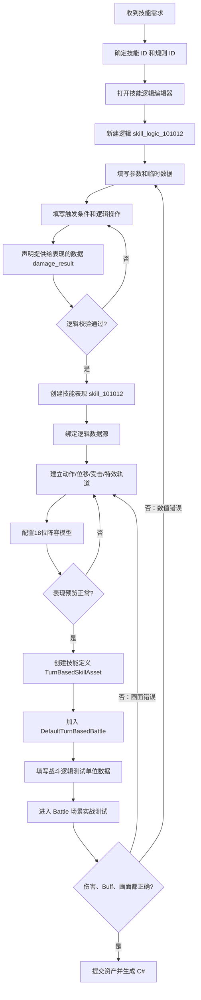
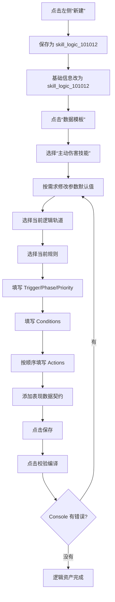
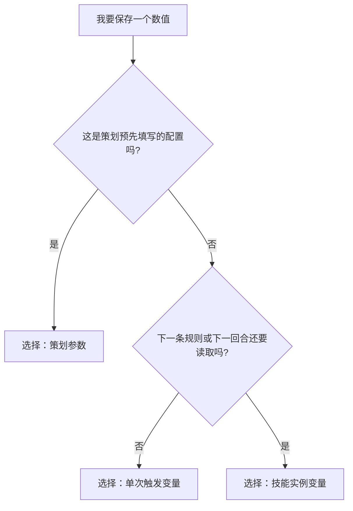
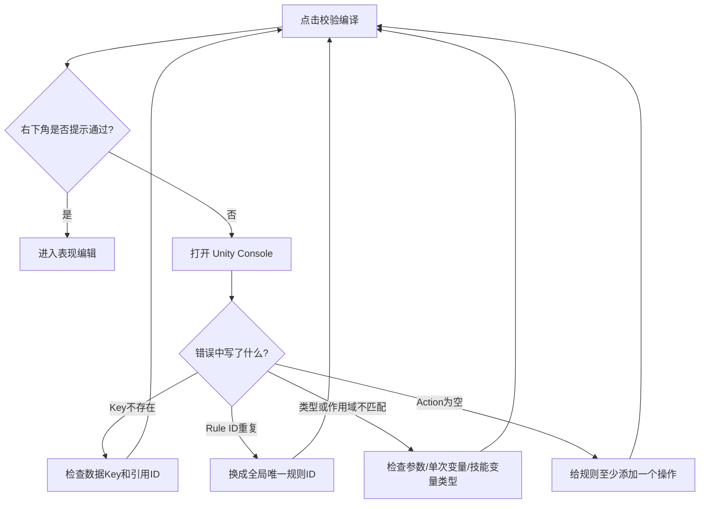
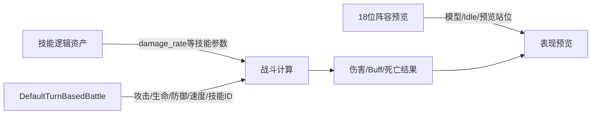
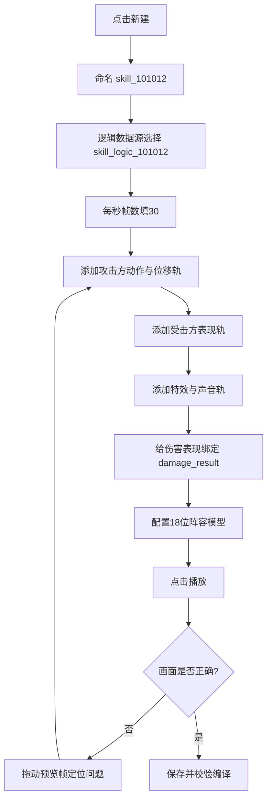
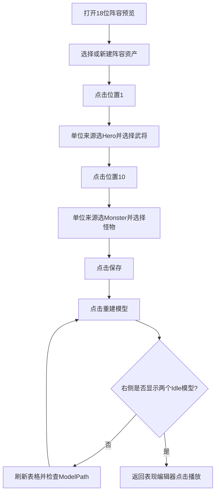
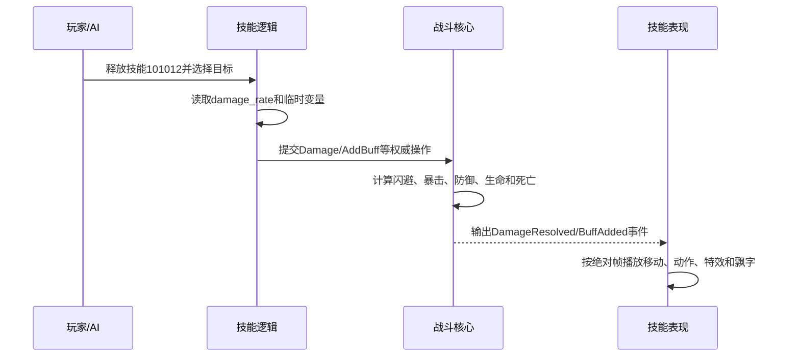
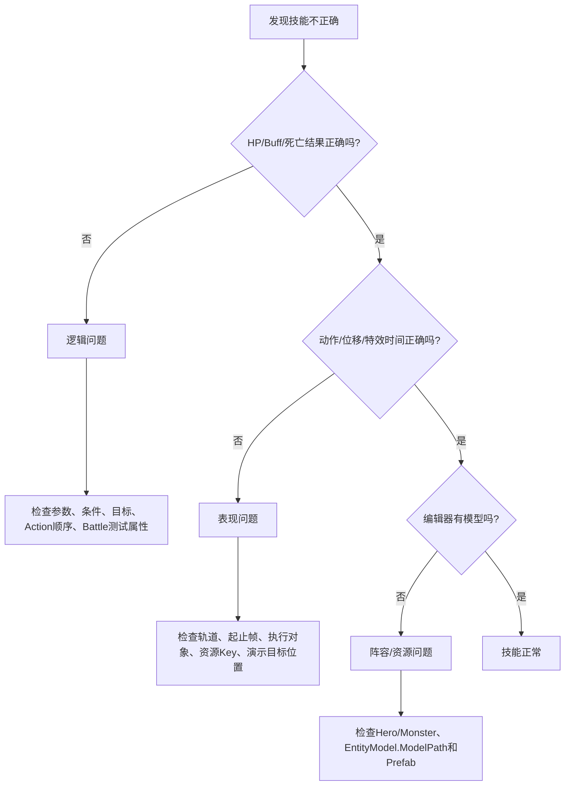
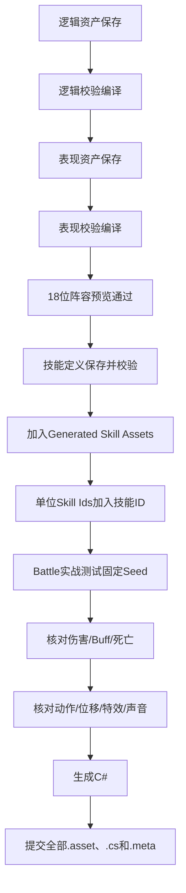

# 回合制技能制作流程图手册（策划版）

> 适用对象：第一次使用本工具的战斗策划。  
> 本手册不要求阅读代码。请从“总流程图”开始，按编号从上往下操作。  
> 文中的完整示例是：`skill_101012` 对选中敌人造成攻击力 135% 的伤害，并有 30% 概率添加 Buff 2001。

第一次制作时，只需按下面的章节顺序操作：

```text
1 总流程 → 3 逻辑编辑 → 4 逻辑测试数据 → 5 表现编辑
        → 6 阵容与播放 → 7 接入 Battle → 10 最终验收
```

遇到问题时直接查看第 8 节；需要制作并行技能时查看第 9 节。

---

## 0. 先记住三句话

1. **逻辑编辑器决定战斗结果**：打谁、伤害多少、是否加 Buff、是否死亡。
2. **表现编辑器决定画面过程**：第几帧移动、播放什么动作、何时出特效和飘字。
3. **18 位阵容预览只提供模型，不提供逻辑属性**：攻击、生命、防御等测试数值要填在 `DefaultTurnBasedBattle.asset`。

---

## 1. 一张图看完整制作流程



如果当前 Markdown 查看器不显示 Mermaid，请按下面这条文字流程执行：

```text
技能需求
  ↓
技能逻辑资产（结果）
  ↓ 保存、校验
技能表现资产（画面）
  ↓ 预览
技能定义资产（把逻辑和表现组合起来）
  ↓ 加入战斗定义并给单位添加技能 ID
DefaultTurnBasedBattle 测试数据
  ↓
Battle 场景实战验收
```

---

## 2. 开始前先准备编号和名称

以新技能 `101012` 为例，先记录下面四个编号：

| 项目 | 本例填写 | 规则 |
| --- | ---: | --- |
| 技能 ID | `101012` | 全项目唯一 |
| 主伤害规则 ID | `10101201` | 所有技能规则中唯一 |
| 概率 Buff 规则 ID | `10101202` | 所有技能规则中唯一 |
| Buff ID | `2001` | 必须已经存在于战斗定义的 Buff 列表 |

资产名称统一使用：

| 资产 | 名称 | 保存目录 |
| --- | --- | --- |
| 技能逻辑 | `skill_logic_101012` | `Assets/GameResources/Battle/TurnBased/Skills/Logic` |
| 技能表现 | `skill_101012` | `Assets/GameResources/Battle/TurnBased/Skills/Expression` |
| 技能定义 | `skill_101012` | `Assets/GameResources/Battle/TurnBased/Skills/Definitions` |

> 左侧列表显示的是资产内部的“逻辑名称/表现名称”，不一定等于文件名。新建后要先修改内部名称。

---

## 3. 逻辑编辑器：从新建到校验

打开菜单：

```text
工具 → 战斗 → 技能逻辑编辑器
```

### 3.1 逻辑制作流程图



### 3.2 第一步：新建逻辑资产

1. 点击左侧“新建”。
2. 文件名填写 `skill_logic_101012`。
3. 在右侧“基础信息”中，把“逻辑名称”也改成 `skill_logic_101012`。
4. “说明”填写一句策划能看懂的描述：

```text
对选中敌人造成攻击力135%的伤害，30%概率添加Buff 2001。
```

新建资产默认带有主动伤害示例。可以修改，不需要全部删除重做。

### 3.3 第二步：理解“测试数据与参数”到底是什么

逻辑编辑器中的“临时数据与参数”分三类：

```text
策划参数
  └─ 填技能配置，例如 135% 伤害倍率、30% 概率、Buff ID
  └─ 会参与正式战斗，不只是预览数据

单次触发变量
  └─ 填一次规则执行中的中间结果
  └─ 例如先算出伤害，再交给 Damage 操作
  └─ 当前规则结束后自动清空

技能实例变量
  └─ 保存同一个单位、同一个技能在整场战斗中的状态
  └─ 例如释放次数、上次触发回合、累计伤害
```

选择数据类型的判断图：



### 3.4 第三步：使用数据模板并填写示例数据

点击右上角：

```text
数据模板 → 主动伤害技能
```

模板会添加常用数据。已有的同名数据不会被覆盖。

本例最终需要下面 5 项。没有的项目点击列表底部 `+` 添加：

| 数据名称 | 数据 Key | 数据种类 | 值类型 | 作用域 | 默认值 | 用途 |
| --- | ---: | --- | --- | --- | ---: | --- |
| `damage_rate` | `1001` | 策划参数（只读） | 万分比 | 不用填 | `13500` | 135% 伤害倍率 |
| `trigger_chance` | `1002` | 策划参数（只读） | 万分比 | 不用填 | `3000` | 30% 触发概率 |
| `buff_id` | `1101` | 策划参数（只读） | 配置标识符 | 不用填 | `2001` | 要添加的 Buff |
| `cast_count` | `2001` | 运行时变量 | 整数 | 技能实例整场 | `0` | 本场释放次数 |
| `temp_value` | `3001` | 运行时变量 | 整数 | 单次规则触发 | `0` | 本次计算出的伤害 |

填写规则：

- 万分比 `10000 = 100%`、`13500 = 135%`、`3000 = 30%`。
- 布尔值只能填 `0` 或 `1`。
- 配置标识符填写表格或战斗定义中的 ID。
- 数据 Key 在当前逻辑资产中不能重复。
- 推荐参数用 `1001~1999`，技能变量用 `2001~2999`，单次变量用 `3001~3999`。
- 发布后不要把已经使用的 Key 改成另一个含义。

> 这里的“默认值”会参与正式战斗。以后如果伤害从 135% 调成 150%，把 `damage_rate` 从 `13500` 改成 `15000` 即可。

### 3.5 第四步：填写主伤害规则

在“逻辑轨道”区域：

1. 当前轨道选择“伤害结算”。没有轨道时点击“添加第一条逻辑轨道”。
2. 轨道名称填写“伤害结算”。
3. 执行组填写“技能主流程”。
4. 执行方式选择“顺序”。
5. 在“当前规则”选择主伤害规则；没有规则时点击“新增”。

规则基础字段填写：

| 字段 | 填写值 | 含义 |
| --- | --- | --- |
| 规则名称 | `技能命中时结算伤害` | 左侧和日志中便于查找 |
| 规则 ID | `10101201` | 必须唯一 |
| 触发事件 | `技能释放` | 点击技能时触发 |
| 执行阶段 | `主阶段` | 正常结算阶段 |
| 优先级 | `0` | 数字越小越先执行 |
| 拥有者必须存活 | 开启 | 死亡单位不能释放 |
| 触发条件 | 可以为空 | 主动释放必定执行 |

在“逻辑操作”中按下面顺序添加 3 个操作。顺序不能颠倒：

```text
操作 1：计算伤害，写入 temp_value
       ↓
操作 2：读取 temp_value，对目标造成伤害
       ↓
操作 3：cast_count + 1
```

#### 操作 1：计算本次技能伤害

| 字段 | 填写值 |
| --- | --- |
| 操作名称 | `计算本次技能伤害` |
| 操作类型 | `设置单次触发变量` |
| 引用 ID | `3001`（temp_value） |
| 数值来源 | `拥有者属性` |
| 属性 | `攻击` |
| 使用动态倍率 | 开启 |
| 动态倍率来源 | `策划参数` |
| 动态倍率引用 ID | `1001`（damage_rate） |
| 最终偏移 | `0` |

这一步的计算结果是：

```text
temp_value = 攻击方攻击力 × 13500 ÷ 10000
```

#### 操作 2：对选中目标造成伤害

| 字段 | 填写值 |
| --- | --- |
| 操作名称 | `对选中目标造成伤害` |
| 操作类型 | `造成伤害` |
| 目标类型 | `技能选中目标` |
| 数量上限 | `0`（不限制） |
| 包含死亡单位 | 关闭 |
| 数值来源 | `单次触发临时变量` |
| 引用 ID | `3001`（temp_value） |
| 倍率 | `10000` |
| 最终偏移 | `0` |
| 启用下限 | 开启 |
| 最小值 | `1` |
| 伤害选项 | 按需求选择“可以闪避/可以暴击/无视防御” |

#### 操作 3：累计释放次数

| 字段 | 填写值 |
| --- | --- |
| 操作名称 | `累计技能释放次数` |
| 操作类型 | `累加技能实例变量` |
| 引用 ID | `2001`（cast_count） |
| 数值来源 | `固定值` |
| 固定值 | `1` |

### 3.6 第五步：填写 30% 概率 Buff 规则

新增第二条规则：

| 字段 | 填写值 |
| --- | --- |
| 规则名称 | `概率添加Buff` |
| 规则 ID | `10101202` |
| 触发事件 | `技能释放` |
| 执行阶段 | `主阶段` |
| 优先级 | `10` |
| 拥有者必须存活 | 开启 |

添加一个条件：

| 字段 | 填写值 |
| --- | --- |
| 条件类型 | `两个动态数值比较` |
| 比较方式 | `小于` |
| 左侧数值来源 | `确定性随机值（0~9999）` |
| 左侧倍率 | `10000` |
| 右侧数值来源 | `策划参数` |
| 右侧引用 ID | `1002`（trigger_chance） |
| 右侧倍率 | `10000` |
| 条件取反 | 关闭 |

条件含义：

```text
随机值 < 3000 时通过，也就是 30% 概率。
```

> 不要使用 Unity Random。这里的随机值来自战斗确定性随机源，相同 Seed 和相同操作会得到相同结果。

添加一个操作：

| 字段 | 填写值 |
| --- | --- |
| 操作名称 | `给目标添加Buff` |
| 操作类型 | `添加 Buff` |
| 目标类型 | `技能选中目标` |
| 数量上限 | `0` |
| 动态引用 ID | 开启 |
| 引用 ID 数值来源 | `策划参数` |
| 引用 ID 数值的引用 ID | `1101`（buff_id） |

如果校验提示“Buff 数据不存在”，说明 `DefaultTurnBasedBattle.asset` 的 Buff 列表中还没有 ID `2001`。

### 3.7 第六步：声明表现需要的逻辑结果

展开“表现数据契约”，添加：

| 数据 Key | 事件类型 | 说明 |
| --- | --- | --- |
| `damage_result` | `伤害结算完成` | 伤害数字、暴击、闪避和死亡结果 |
| `buff_added` | `获得 Buff` | Buff 添加结果 |

表现编辑器只能选择这里已经声明的 Key。

本例中：

- 动作、移动、声音、普通特效不需要绑定逻辑数据。
- 伤害飘字和死亡检查绑定 `damage_result`。
- Buff 飘字绑定 `buff_added`。

### 3.8 第七步：保存和校验

按顺序点击：

```text
保存 → 校验编译
```

校验结果判断：



“生成 C#”不是每次预览的前置条件。策划日常编辑只需要“保存、校验编译”；准备提交或程序要求时再点击“生成 C#”。

---

## 4. 逻辑测试数据：到底填在哪里

这是最容易填错的部分。先看数据分工图：



| 你要测试的内容 | 填写位置 | 是否影响正式逻辑 |
| --- | --- | --- |
| 135% 伤害倍率 | 逻辑资产的 `damage_rate` 默认值 | 是 |
| 30% Buff 概率 | 逻辑资产的 `trigger_chance` 默认值 | 是 |
| 攻击方攻击力 100 | `DefaultTurnBasedBattle` 的 Units | 是 |
| 防守方生命 1000、防御 10 | `DefaultTurnBasedBattle` 的 Units | 是 |
| 测试随机结果 | `DefaultTurnBasedBattle` 的 Random Seed | 是 |
| 预览用哪个武将模型 | 18 位阵容与模型预览 | 否，只影响编辑器画面 |
| 第几帧移动和受击 | 技能表现资产 | 否，只影响画面 |

### 4.1 创建技能定义资产

逻辑要进入 Battle 测试，必须先创建技能定义：

```text
Project 窗口右键
  → Create
  → LxyDemo
  → 战斗
  → 回合制技能
```

保存为：

```text
Assets/GameResources/Battle/TurnBased/Skills/Definitions/skill_101012.asset
```

填写：

| 字段 | 本例填写 |
| --- | --- |
| 技能 ID | `101012` |
| 显示名称 | `测试技能101012` |
| 消耗属性 | `能量` |
| 消耗数值 | `0` |
| 目标模式 | `单个敌人` |
| 主动技能 | 开启 |
| 备用动作名称 | `attack_1` |
| 技能逻辑 | `skill_logic_101012` |
| 技能表现 | 暂时可空，完成表现后再绑定 |

点击 Inspector 中的“保存并校验”。

### 4.2 把技能加入测试战斗

在 Project 窗口打开：

```text
Assets/GameResources/Battle/TurnBased/DefaultTurnBasedBattle.asset
```

找到 `Generated Skill Assets`：

1. 保留已有技能资产。
2. 点击 `+`。
3. 把 `skill_101012.asset` 拖入新位置。

> 只创建逻辑和表现资产还不能在 Battle 释放，技能定义必须进入 `Generated Skill Assets`。

### 4.3 填写一组最容易核对的单位测试数据

在 `Units` 中至少准备两个单位。

攻击方：

| 字段 | 建议测试值 |
| --- | ---: |
| Unit Id | `1` |
| Config Id | 选择一个有效 Hero ID，例如 `101` |
| Display Name | `测试攻击方` |
| Camp | `攻击方` |
| Control | `玩家` |
| Position | `1` |
| Max Hp | `1000` |
| Attack | `100` |
| Defense | `0` |
| Speed | `100` |
| Crit Rate | `0` |
| Crit Damage | `15000` |
| Hit Rate | `10000` |
| Dodge Rate | `0` |
| Energy | `100` |
| Skill Ids | 增加 `101012` |
| View Prefab | 拖入测试武将 Prefab |
| Idle Animation | `idle_1` |

防守方：

| 字段 | 建议测试值 |
| --- | ---: |
| Unit Id | `2` |
| Config Id | 选择一个有效 Monster ID，例如 `201` |
| Display Name | `测试防守方` |
| Camp | `防守方` |
| Control | `AI` |
| Position | `10` |
| Max Hp | `1000` |
| Attack | `80` |
| Defense | `10` |
| Speed | `80` |
| Crit Rate | `0` |
| Hit Rate | `10000` |
| Dodge Rate | `0` |
| Energy | `100` |
| Skill Ids | 填一个已存在的主动技能，例如 `1001` |
| View Prefab | 拖入测试怪物 Prefab |
| Idle Animation | `idle_1` |

战斗定义顶部 `Random Seed` 填一个固定数字，例如 `20260909`。同一轮测试不要反复修改 Seed。

### 4.4 怎么判断逻辑结果对不对

本例攻击力 `100`、倍率 `13500`、目标防御 `10`，并且伤害没有勾选“无视防御”时：

```text
倍率后伤害 = 100 × 13500 ÷ 10000 = 135
最终伤害   = 135 - 10 = 125
目标剩余HP = 1000 - 125 = 875
```

为了第一次测试容易核对：

- 暂时关闭“可以暴击”。
- 攻击方 Hit Rate 填 `10000`，防守方 Dodge Rate 填 `0`。
- 保持固定 Random Seed。
- 先确认伤害稳定为 `125`，再逐项打开暴击、闪避和概率 Buff。

Buff 概率测试不能只释放一次。建议保持同一 Seed，重复进入 Battle 并记录结果；要测试必定添加，可以先临时把 `trigger_chance` 改为 `10000`，验证成功后再改回 `3000`。

---

## 5. 表现编辑器：从空白时间轴到可播放

打开菜单：

```text
工具 → 战斗 → 技能表现编辑器
```

### 5.1 表现制作流程图



### 5.2 新建并绑定逻辑

1. 左侧点击“新建”。
2. 输入并保存为 `skill_101012`。
3. “表现名称”填写 `skill_101012`。
4. “逻辑数据源”选择 `skill_logic_101012`。
5. “每秒帧数”填写 `30`。
6. “自动计算总帧数”开启。
7. “说明”填写：

```text
攻击方突进到目标，播放攻击动作；第8帧命中并播放受击、飘字和特效；第20帧返回。
```

如果“逻辑数据”下拉列表中没有 `damage_result`，返回逻辑编辑器检查“表现数据契约”，保存并刷新表现编辑器。

### 5.3 轨道和并行应该怎么理解

```text
主并行组
├─ 攻击方动作与位移轨（顺序）
│    0帧动作 → 0~5帧移动 → 20~25帧返回
├─ 受击方表现轨（并行）
│    8~12帧受击 + 8~14帧飘字
└─ 特效与声音轨（并行）
     6~10帧特效 + 8帧声音
```

- “顺序”轨道：同一轨道中的两个持续操作不能重叠。
- “并行”轨道：同一轨道中的操作可以同时发生。
- 并行不是多线程，只表示同一时间可以播放多个画面操作。
- 时间统一填写绝对帧，不需要添加 Delay。

### 5.4 建立攻击方动作与位移轨

添加第一条表现轨：

| 字段 | 填写值 |
| --- | --- |
| 轨道名称 | `攻击方动作与位移` |
| 并行组 | `主并行组` |
| 轨内方式 | `顺序` |

添加下面 3 个帧操作：

#### 帧操作 A：播放攻击动作

| 字段 | 填写值 |
| --- | --- |
| 操作标记 | `角色/播放动作` |
| 逻辑数据 | `<不绑定逻辑数据>` |
| 执行对象 | `攻击方` |
| 开始帧 | `0` |
| 结束帧 | `0` |
| 动作名称 | `attack_1` |
| 循环播放 | 关闭 |

#### 帧操作 B：移动到目标

| 字段 | 填写值 |
| --- | --- |
| 操作标记 | `角色/移动到逻辑目标` |
| 逻辑数据 | `<不绑定逻辑数据>` |
| 执行对象 | `攻击方` |
| 开始帧 | `0` |
| 结束帧 | `5` |
| 演示目标位置 | `10` |
| 目标相对偏移 | `X=-2.5, Y=0, Z=-1` |

“演示目标位置 10”只用于编辑器画面。正式战斗会移动到逻辑真正选中的敌人，不会永远攻击 10 号位。

#### 帧操作 C：返回原站位

| 字段 | 填写值 |
| --- | --- |
| 操作标记 | `角色/返回原站位` |
| 执行对象 | `攻击方` |
| 开始帧 | `20` |
| 结束帧 | `25` |
| 返回动作 | 可空，或填写移动动作名 |

### 5.5 建立受击方表现轨

新增第二条轨道：

| 字段 | 填写值 |
| --- | --- |
| 轨道名称 | `受击方表现` |
| 并行组 | `主并行组` |
| 轨内方式 | `并行` |

添加：

| 操作标记 | 逻辑数据 | 执行对象 | 开始帧 | 结束帧 | 关键参数 |
| --- | --- | --- | ---: | ---: | --- |
| `角色/触发受击组合` | `damage_result` | 受击方 | `8` | `12` | 受击抖动倍率 `1` |
| `结算/伤害与飘字` | `damage_result` | 受击方 | `8` | `14` | 默认即可 |
| `角色/颜色闪烁` | `damage_result` | 受击方 | `8` | `12` | 红色、强度 `1` |
| `结算/死亡表现` | `damage_result` | 受击方 | `14` | `25` | 默认即可 |

伤害、暴击、闪避、死亡只能读取逻辑结果，不能在表现编辑器里自行决定。

### 5.6 建立特效与声音轨

新增第三条轨道，轨内方式选择“并行”：

| 操作标记 | 逻辑数据 | 执行对象 | 开始帧 | 结束帧 | 资源 Key |
| --- | --- | --- | ---: | ---: | --- |
| `特效/挂点特效` | 不绑定 | 攻击方 | `6` | `12` | 填项目中的技能特效地址 |
| `音频/播放音效` | 不绑定 | 攻击方 | `8` | `8` | 填项目中的音效地址 |
| `飘字/Buff 飘字` | `buff_added` | 受击方 | `10` | `16` | 按项目资源填写 |

没有正式资源时，可以先不添加特效和声音轨，只验证动作、移动、受击和时间节奏。

---

## 6. 配置 18 位阵容并播放表现

打开：

```text
工具 → 战斗 → 18 位阵容与模型预览
```

### 6.1 阵容预览流程图



### 6.2 最小阵容怎么填

1. 点击位置 `1`，单位来源选择 `Hero`，单位配置选择一个武将。
2. 点击位置 `10`，单位来源选择 `Monster`，单位配置选择一个怪物。
3. 模型缩放先保持 `(1,1,1)`。
4. 点击“保存”。
5. 点击“重建模型”。

模型读取顺序：

```text
Hero/Monster 表
  → EntityId
  → EntityModel 表
  → ModelPath
  → 加载模型 Prefab
  → 默认播放 Idle
```

如果右侧是黑色：

```text
先点击“刷新表格”
  ↓
检查位置1和10是否都选择了单位
  ↓
检查详情中的 EntityId 是否大于0
  ↓
检查 ModelPath 是否为空
  ↓
检查是否提示“Prefab未找到”
  ↓
点击“重建模型”
```

### 6.3 播放按钮怎么用

返回技能表现编辑器：

1. 点击“保存”。
2. 点击“校验编译”。
3. 点击“阵容模型预览”，确认模型存在。
4. 点击“播放”。
5. 发现某一帧不对时点击“暂停”，拖动“预览帧”滑条逐帧查看。
6. 点击“停止”返回第 0 帧。

> 表现预览不会真的计算攻击力和伤害。真实伤害数字要进入 Battle 场景测试。

---

## 7. 把逻辑和表现接入正式 Battle

表现制作完成后，重新选择 `skill_101012.asset` 技能定义：

1. “技能逻辑”选择 `skill_logic_101012`。
2. “技能表现”选择 `skill_101012`。
3. 点击“保存并校验”。
4. 确认技能定义仍在 `DefaultTurnBasedBattle.asset` 的 `Generated Skill Assets` 中。
5. 确认攻击方 Unit 的 `Skill Ids` 包含 `101012`。
6. 打开 `Assets/Scenes/Battle.unity`。
7. 进入 Play Mode。
8. 轮到攻击方时选择技能 `101012`，再选择防守方。

正式运行链路：



如果技能按钮没有出现，按下面顺序检查：

```text
技能定义的“主动技能”是否开启？
  ↓ 是
技能定义是否在 Generated Skill Assets？
  ↓ 是
当前单位 Skill Ids 是否包含 101012？
  ↓ 是
技能 ID 是否和别的技能重复？
  ↓ 否
查看 Console 校验错误
```

---

## 8. 逻辑错误还是表现错误：快速判断图



常见现象对照：

| 现象 | 应该检查哪里 |
| --- | --- |
| 伤害数值不对 | 逻辑参数、动态倍率、目标防御、伤害选项 |
| Buff 没加 | 概率条件、Buff ID、BattleDefinition Buff 列表 |
| 技能完全不触发 | Trigger、技能 ID、单位 Skill Ids、主动技能开关 |
| 飘字没出现 | 表现是否绑定 `damage_result` |
| 攻击者移动到错误位置 | MoveToTarget 的演示目标位和目标相对偏移 |
| 正式战斗攻击了另一个敌人 | 逻辑 TargetSelector，而不是表现演示目标位 |
| 预览是黑色 | 18 位阵容、EntityModel.ModelPath、模型 Prefab |
| Sequence 轨道校验失败 | 同一顺序轨中的持续帧区间发生重叠 |
| Key 不存在 | 数据定义 Key 与 Action 引用 ID 不一致 |
| 类型或作用域不匹配 | 把参数、单次变量或技能变量选错了 |

---

## 9. 并行逻辑和并行表现怎么填

### 9.1 逻辑并行

当一个触发事件需要同时表达多个独立分支时，使用多个逻辑轨道，并把执行方式设为“并行”：

```text
执行组：技能命中处理

轨道 A：主目标伤害       Parallel
轨道 B：概率添加 Buff    Parallel
轨道 C：记录成就条件     Parallel
```

它们不会开启线程。真实结算顺序始终稳定：

```text
执行阶段 → 优先级 → 所属单位 → 规则 ID
```

如果 B 必须读取 A 写入的技能变量，让 A 的优先级小于 B，例如 A=`0`、B=`10`。

### 9.2 表现并行

同一个命中帧可以同时播放受击、飘字、音效和震屏：

```text
第8帧
├─ 受击动作
├─ 伤害飘字
├─ 命中特效
├─ 命中声音
└─ 镜头震屏
```

把它们放在相同“并行组”的不同轨道，或放在轨内方式为“并行”的同一轨道。

---

## 10. 提交前最终验收流程图



提交前逐项勾选：

- [ ] 文件名、逻辑名称、表现名称使用同一个技能编号。
- [ ] 技能 ID 唯一，所有规则 ID 唯一。
- [ ] 参数 Key 和变量 Key 没有重复。
- [ ] 参数、单次变量、技能变量的作用域选择正确。
- [ ] 每条规则至少有一个逻辑操作。
- [ ] 需要先算后用的操作顺序正确。
- [ ] 概率使用“确定性随机值”，没有使用 Unity Random。
- [ ] `damage_result` 等逻辑输出已经声明。
- [ ] 表现资产绑定了正确的逻辑数据源。
- [ ] 伤害、Buff、死亡表现绑定了对应逻辑数据。
- [ ] 顺序轨道不存在持续帧重叠。
- [ ] 位置 1 和位置 10 至少各有一个预览模型。
- [ ] 技能定义已加入 `Generated Skill Assets`。
- [ ] 测试单位的 `Skill Ids` 已加入新技能 ID。
- [ ] 使用固定 Seed 验证过逻辑结果。
- [ ] 在 Battle 场景验证过真实逻辑和表现。
- [ ] 提交前已经生成 C#。

---

## 11. 当前版本暂时不能直接配置的能力

以下能力不要在编辑器里用相似字段勉强拼接，应先联系程序扩展通用运行时：

- 可修改最终伤害的 `BeforeDamage` 管线。
- 完整召唤单位工厂。
- 行动条推进或拉退。
- 按标签驱散、精确修改 Buff 层数和免疫体系。
- 保存一组目标的“目标集合变量”。
- 多段伤害对应多个独立表现目标。

参考分析见 `BattleLogicReferenceAnalysis.md`。

---

## 12. 可以直接参考的现有资产

```text
Assets/GameResources/Battle/TurnBased/Skills/
├─ Logic/skill_logic_1001.asset
├─ Logic/skill_logic_1002.asset
├─ Logic/skill_logic_ach_tiaozhan_level_jinnang_3.asset
├─ Expression/skill_101011.asset
├─ Definitions/skill_1001.asset
├─ Definitions/skill_1002.asset
└─ Definitions/skill_ach_tiaozhan_level_jinnang_3.asset

Assets/GameResources/Battle/TurnBased/Formations/DefaultBattleFormation.asset
Assets/GameResources/Battle/TurnBased/DefaultTurnBasedBattle.asset
Assets/Scenes/Battle.unity
```

日常制作不要点击“生成参考技能逻辑与表现资产”。该菜单用于重建工程参考资产，可能重新设置默认战斗定义中的参考技能列表。
